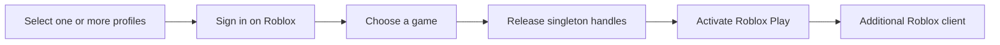

# Roblox Alt Client

An open-source Windows client for launching multiple Roblox accounts with isolated local login sessions. It includes a desktop interface, built-in and user-created game presets, custom game URLs, and automatic Roblox singleton-handle release.



## Privacy

- No passwords, `.ROBLOSECURITY` tokens, or credentials are collected by the app.
- Nothing is uploaded or sent to the developer.
- Login sessions remain locally inside separate Microsoft WebView2 profiles.
- Only profile labels, IDs, custom game presets, and browser-session data are saved on the user's computer.
- Removing an account through the client clears its active local browser session.

## Run the client

Use either:

- [Download the latest `RobloxAltClient.exe`](https://github.com/CodySimonds65/roblox-alt-launcher/releases/latest/download/RobloxAltClient.exe)
- Run `run-client.cmd` from a source checkout

Then add account profiles and sign in directly on Roblox's official page. Check one or more profiles, select a game, and click **Auto-launch selected**. Use the **+** button beside the game dropdown to save your own named Roblox game presets; they remain local to your PC. The client launches each account in sequence, waiting for its Roblox process before preparing the next one. If Roblox changes its page, the visible Play button remains available as a fallback.

The Activity panel is selectable and copy-pasteable. Use **Copy all** to copy the complete diagnostic log.

## Prebuilt release

The release is a single self-contained Windows x64 executable. Users only need `RobloxAltClient.exe`; .NET is included. Each release also includes `SHA256SUMS.txt` so the download can be verified. Microsoft WebView2 Runtime is the only system requirement. It is included with Windows 11, and the client links to Microsoft's installer if it is missing.

On the first multi-launch, the client downloads Sysinternals Handle directly from Microsoft and caches it under `%LOCALAPPDATA%\RobloxAltClient\Tools`. The Microsoft utility is not redistributed with this project.

## Build it yourself

Requirements for compiling: Windows, .NET 8 SDK or newer, and the Microsoft WebView2 Runtime.

Run:

```text
build-client.cmd
```

The compiled client is written to `release\RobloxAltClient.exe`. Source code is under `client\` and released under the MIT License so users can audit and compile it themselves instead of trusting a prebuilt executable.

## Automatic releases

Merging a pull request into `main` creates a release when its title or labels include a release keyword:

| Keyword | Version bump |
| --- | --- |
| `chore` or `fix` | Patch (`1.0.0` → `1.0.1`) |
| `minor` | Minor (`1.0.0` → `1.1.0`) |
| `major` or `BREAKING` | Major (`1.0.0` → `2.0.0`) |

The workflow builds and tests the merged commit, publishes `RobloxAltClient.exe`, generates a SHA-256 checksum, and creates GitHub release notes automatically. Keywords are case-insensitive; the highest matching bump wins.

## PowerShell version

The earlier guided launcher remains available through `launch.cmd`. It uses `Launch-RobloxAlts.ps1` and downloads Sysinternals Handle directly from Microsoft when needed.

Roblox updates may change or disable multi-instance behavior. Use the project only where permitted by Roblox and the applicable game rules.
