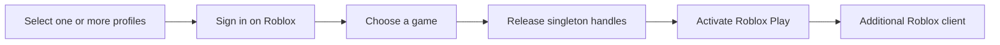

# Roblox Account Manager

An open-source Windows launcher for running multiple Roblox accounts with separate local login sessions.



## Download and use

[Download the latest `RobloxAccountManager.exe`](https://github.com/CodySimonds65/roblox-account-manager/releases/latest/download/RobloxAccountManager.exe)

1. Add a profile and sign in on Roblox.
2. Select one or more profiles.
3. Choose a game preset or paste a Roblox game URL.
4. Click **Auto-launch selected**.

Profiles support groups, favorites, drag ordering, and multi-select launch queues. Game presets can be searched, edited, duplicated, imported, or exported; private-server links are supported.

The Windows x64 EXE includes .NET. Microsoft WebView2 Runtime is required. Updates are downloaded from GitHub, checksum-verified, and installed after you approve a restart.

Windows requests administrator approval once when the client starts. The approved security context is reused to release Roblox's single-instance handles, so launching additional accounts does not produce more UAC prompts.

## Privacy

- Credentials and `.ROBLOSECURITY` tokens are never collected or sent to the developer.
- Profiles, login sessions, and game presets stay on your computer.
- The client contacts Roblox, GitHub for updates, and Microsoft for Sysinternals Handle.
- Removing a profile clears its active local browser session.

## Build it yourself

Requires Windows, the .NET 8 SDK or newer, and Microsoft WebView2 Runtime.

```text
build-client.cmd
```

Output: `release\RobloxAccountManager.exe`. The source is under `client\` and licensed under MIT.

Release signing is optional. Configure a base64-encoded PFX as `WINDOWS_SIGNING_CERTIFICATE_BASE64` and its password as `WINDOWS_SIGNING_CERTIFICATE_PASSWORD` in GitHub repository secrets. Releases are signed before checksums are generated.

## Game settings

The **Game settings** tab stores global defaults and optional per-game overrides. Graphics quality and maximum frame rate update Roblox's native in-game preferences for the next launch. MSAA, texture quality, scaling, and advanced flags are temporarily merged into `ClientAppSettings.json`, then the original file is restored. Roblox or Bloxstrap can ignore or reject engine flags after an update; the Activity log reports detected rejections.

## Notes

- The first multi-launch downloads Sysinternals Handle to `%LOCALAPPDATA%\RobloxAltClient\Tools`.
- Multi-launch reuses the client's existing elevated security context for the queue.
- The C# client is the sole supported launcher; account launching does not invoke PowerShell.
- The Activity log can be selected or copied with **Copy all**.

Roblox updates may change or disable multi-instance behavior. Use the project only where permitted by Roblox and the applicable game rules.

Roblox processes launched by the elevated client may also run elevated. Launching the game unelevated would require a separate privilege-boundary design and is not attempted here.
